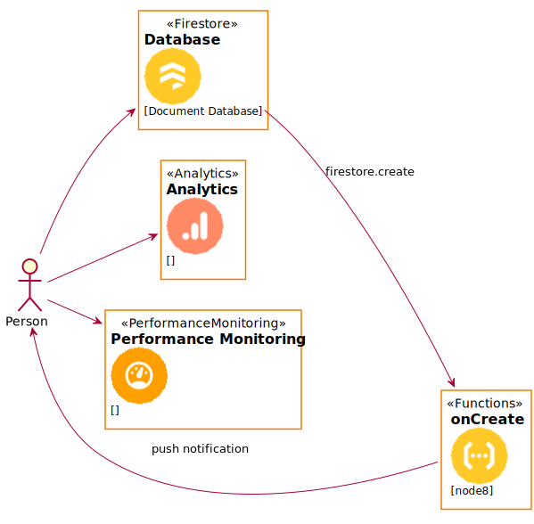
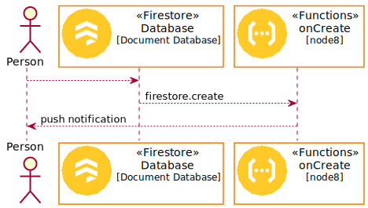

# Firebase PlantUML Icons

## Examples

### activity

```puml
@startuml
left to right direction
!define FirebasePuml https://raw.githubusercontent.com/k2wanko/firebase-icons-plantuml/master/plantuml
!includeurl FirebasePuml/FirebaseCommon.puml
!includeurl FirebasePuml/FirebaseAll.puml

actor "Person" as personAlias
Firestore(db, "Database", "Document Database")
Functions(func, "onCreate", "node8")
Analytics(ga, "Analytics", "")
PerformanceMonitoring(monitor, "Performance Monitoring", "")


personAlias --> db
db --> func: firestore.create
func --> personAlias: push notification

personAlias --> ga
personAlias --> monitor
@enduml
```



### sequence

```puml
@startuml
!define FirebasePuml https://raw.githubusercontent.com/k2wanko/firebase-icons-plantuml/master/plantuml
!includeurl FirebasePuml/FirebaseCommon.puml
!includeurl FirebasePuml/FirebaseAll.puml

actor "Person" as personAlias
FirestoreParticipant(db, "Database", "Document Database")
FunctionsParticipant(func, "onCreate", "node8")

personAlias --> db
db --> func: firestore.create
func --> personAlias: push notification
@enduml
```

