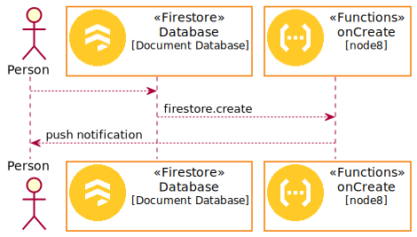

# Firebase PlantUML Icons

## Examples

### activity

```puml
@startuml
left to right direction
!define FirebasePuml https://raw.githubusercontent.com/k2wanko/firebase-icons-plantuml/master/plantuml
!includeurl FirebasePuml/FirebaseCommon.puml
!includeurl FirebasePuml/FirebaseAll.puml

actor "Person" as personAlias
Firestore(db, "Database", "Document Database")
Functions(func, "onCreate", "node8")
Analytics(ga, "Analytics", "")
PerformanceMonitoring(monitor, "Performance Monitoring", "")


personAlias --> db
db --> func: firestore.create
func --> personAlias: push notification

personAlias --> ga
personAlias --> monitor
@enduml
```


### sequence

```puml
@startuml
!define FirebasePuml https://raw.githubusercontent.com/k2wanko/firebase-icons-plantuml/master/plantuml
!includeurl FirebasePuml/FirebaseCommon.puml
!includeurl FirebasePuml/FirebaseAll.puml

actor "Person" as personAlias
FirestoreParticipant(db, "Database", "Document Database")
FunctionsParticipant(func, "onCreate", "node8")

personAlias --> db
db --> func: firestore.create
func --> personAlias: push notification
@enduml
```



# Icons
<!-- icons-begin -->
|  Product  |  Icon  | Rectangle | Participant |
| --------- | ------ | --------- | ----------- |
| Firebase Dynamic Links |  | DynamicLinks(alias, "", "") | DynamicLinksParticipant(alias, "", "") |
| Cloud Firestore |  | Firestore(alias, "", "") | FirestoreParticipant(alias, "", "") |
| Firebase Predictions |  | Predictions(alias, "", "") | PredictionsParticipant(alias, "", "") |
| ML Kit for Firebase |  | MLKit(alias, "", "") | MLKitParticipant(alias, "", "") |
| Firebase App Indexing |  | AppIndexing(alias, "", "") | AppIndexingParticipant(alias, "", "") |
| Firebase Realtime Database |  | RealtimeDatabase(alias, "", "") | RealtimeDatabaseParticipant(alias, "", "") |
| Firebase Crash Reporting |  | CrashReporting(alias, "", "") | CrashReportingParticipant(alias, "", "") |
| Cloud Storage for Firebase |  | Storage(alias, "", "") | StorageParticipant(alias, "", "") |
| Google Analytics |  | Analytics(alias, "", "") | AnalyticsParticipant(alias, "", "") |
| Firebase Remote Config |  | RemoteConfig(alias, "", "") | RemoteConfigParticipant(alias, "", "") |
| Firebase App Distribution |  | AppDistribution(alias, "", "") | AppDistributionParticipant(alias, "", "") |
| Firebase Test Lab |  | TestLab(alias, "", "") | TestLabParticipant(alias, "", "") |
| Firebase Authentication |  | Authentication(alias, "", "") | AuthenticationParticipant(alias, "", "") |
| Firebase Performance Monitoring |  | PerformanceMonitoring(alias, "", "") | PerformanceMonitoringParticipant(alias, "", "") |
| Firebase AB Testing |  | ABTesting(alias, "", "") | ABTestingParticipant(alias, "", "") |
| Firebase Invites |  | Invites(alias, "", "") | InvitesParticipant(alias, "", "") |
| Firebase Extensions |  | Extensions(alias, "", "") | ExtensionsParticipant(alias, "", "") |
| Cloud Functions for Firebase |  | Functions(alias, "", "") | FunctionsParticipant(alias, "", "") |
| Firebase Crashlytics |  | Crashlytics(alias, "", "") | CrashlyticsParticipant(alias, "", "") |
| Firebase Hosting |  | Hosting(alias, "", "") | HostingParticipant(alias, "", "") |
| Firebase Cloud Messaging |  | Messaging(alias, "", "") | MessagingParticipant(alias, "", "") |
| Firebase In-App Messaging |  | InAppMessaging(alias, "", "") | InAppMessagingParticipant(alias, "", "") |
<!-- icons-end -->
